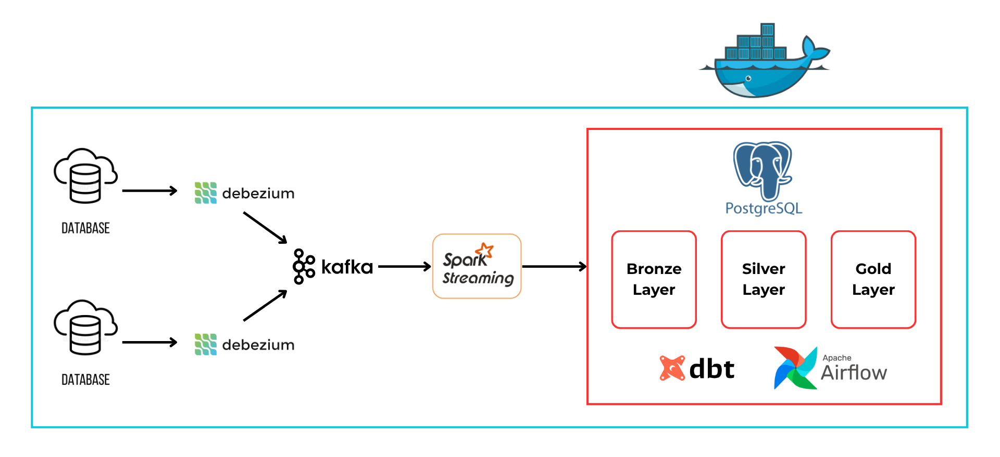
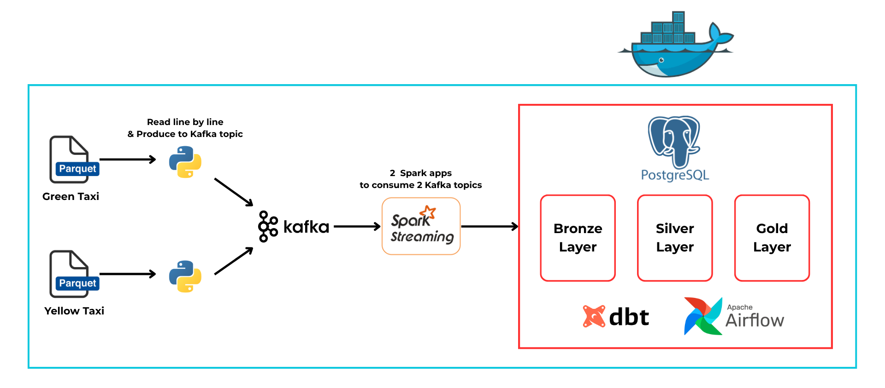
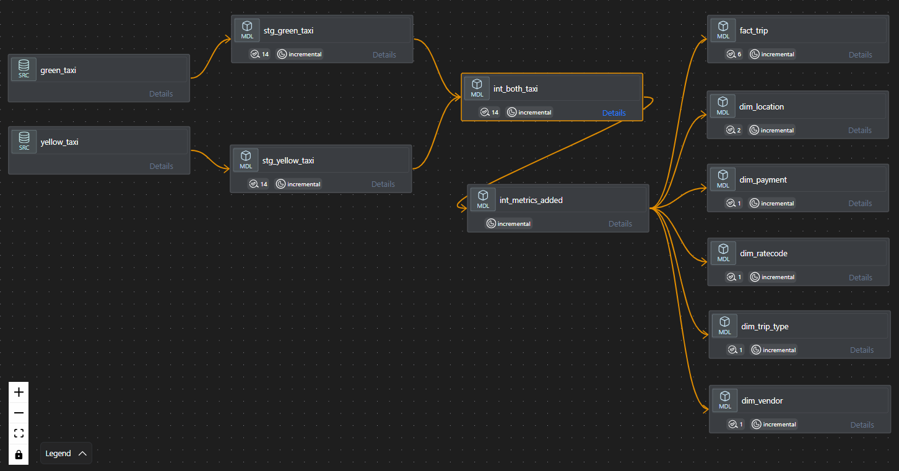
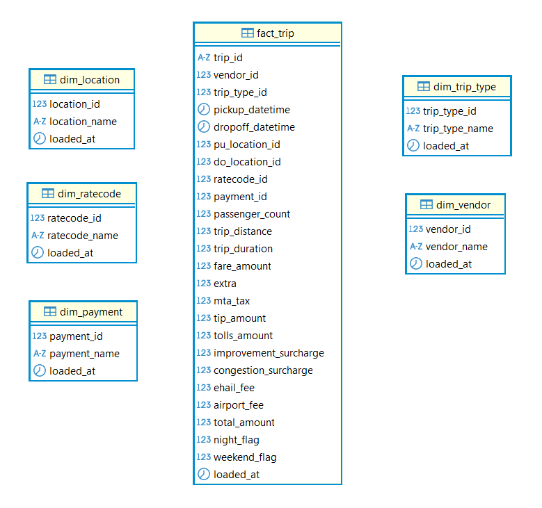
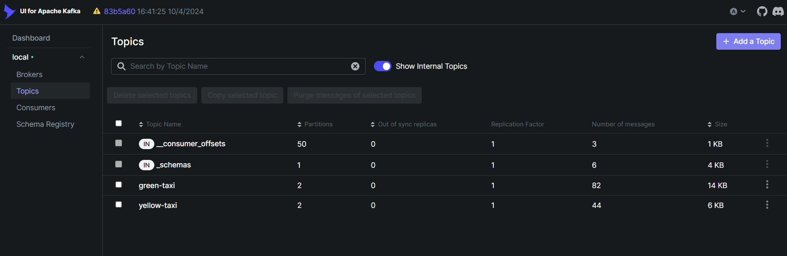
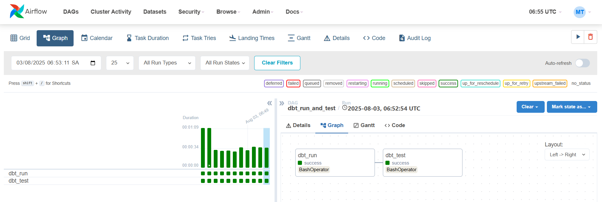

# 📑 Table of Contents

- [📌 1. Introduction](#-1-introduction)
- [🏗 2. Architecture](#-2-architecture)
- [🚧 3. Data Modeling](#-3-data-modeling)
- [📂 4. Project Structure](#-4-project-structure)
- [🚀 5. Setup](#-5-setup)

---

# 📌 1. Introduction
This project showcases a **near-real-time ELT (Extract, Load, Transform) pipeline** built entirely with open-source tools.

The source data comes from the [NYC Taxi & Limousine Commission (TLC) Trip Record Data](https://www.nyc.gov/site/tlc/about/tlc-trip-record-data.page), provided as Parquet files.

Key components include:  
- `Ingestion`: A Python producer reads the Parquet data line-by-line and streams it to a **Kafka** topic to simulate real-time data flow.  
- `Loading`: **Spark Structured Streaming** consumes data from Kafka, applies lightweight processing, and loads it into a **DWH**.  
- `Transformation`: **dbt** is used to transform and model the raw data across multiple layers: raw → staging → intermediate → mart.
- `Orchestration`: **Airflow** manages and schedules the entire transformation workflow to ensure reliability and automation.  

---

# 🏗 2. Architecture
## 2.1 Original Pipeline


## 2.2 Alternative Pipeline  
Since the only available data source is a Parquet file (with no direct database connection), Debezium cannot be used. Instead, a Python producer reads the file line-by-line and sends each record to a Kafka topic to simulate real-time data ingestion.


---

# 🚧 3. Data Modeling
Below is the dbt model lineage illustrating the flow of transformations:


And here is the star schema design used in the data warehouse to support analytical queries:


---

# 📂 4. Project Structure
```text
streaming-elt-project/
│
├── data/                                # Sample dataset files (Parquet) used for streaming simulation
├── docker/                              # Custom Dockerfiles & extra configs for docker-compose services
├── experiments/                         # Notebooks & scripts for testing pipeline
├── readme/                              # Documentation assets (diagrams, images, and additional notes)
├── src/
│   ├── streaming_scripts/               # Python scripts for Kafka producer and Spark Structured Streaming consumer
│   │   └── ...                         
│   └── dbt/                            
│       ├── nyc_taxi/                    # dbt project
│       │   ├── macros                     # dbt reusable SQL snippets/functions
│       │   ├── models                     # dbt data transformation models, organized into layers:
│       │   │   └── staging                  - clean and standardize raw source data
│       │   │   └── intermediate             - join, enrich, and aggregate staging data
│       │   │   └── mart                     - business-ready tables for analytics & BI
│       │   ├── ...   
│       │   ├── dbt_project.yml            # dbt project configuration
│       │   └── packages.yml               # dbt dependencies
│       ├── profiles.yml                 # Database connection settings for dbt
│       └── dag.py                       # Airflow DAG to run dbt commands (dbt run, dbt test)
│
├── docker-compose-dwh-dbt-airflow.yml   # Compose file for DWH, dbt, and Airflow services
├── docker-compose-kafka.yml             # Compose file for Kafka cluster, Schema Registry, and Kafka UI
├── docker-compose-spark.yml             # Compose file for Spark cluster
```

---

# 🚀 5. Setup
## 5.1 Prerequisites  
Before starting, please ensure you have:  
- Docker Desktop installed and running on your machine.  

## 5.2 Start Services  
Start the required services in the following order by running these commands in your terminal:

```bash
docker network create common-net
docker-compose -f docker-compose-kafka.yml up -d
docker-compose -f docker-compose-spark.yml up -d
docker-compose -f docker-compose-dwh-dbt-airflow.yml up -d
```
## 5.3 Accessing Services
- `Kafka UI`: http://localhost:8080
- `Spark Master UI`: http://localhost:8082
- `Spark Worker 1 UI`: http://localhost:8083
- `Spark Worker 2 UI`: http://localhost:8084
- `Airflow Webserver` is accessible at http://localhost:8085 with credentials:
  - Username: airflow
  - Password: 123456
- `Postgres DWH` is accessible on port 5432 with credentials:
  - User: postgres
  - Password: 123456
  - Database: taxi_dwh

## 5.4. Running the Pipeline
### Step 1: Send Data to Kafka (Simulate Streaming)
- Access the spark-master container: `docker exec -it spark-master bash`
- Navigate to the working directory `/opt/spark/app/`, then execute the following scripts to simulate streaming by sending line by line from Parquet file to Kafka topics:
  - `python send_green.py`
  - `python send_yellow.py`
- To monitor the streaming data and check the messages sent to Kafka topics, open the Kafka UI:


### Step 2: Consume Data from Kafka
- Access the spark-master container: `docker exec -it spark-master bash`
- From the working directory `/opt/spark/app/`, submit the Spark jobs that will consume data from Kafka, perform processing, and load the results into the Data Warehouse:
  - `spark-submit receive_green.py`
  - `spark-submit receive_yellow.py`
- To monitor Spark cluster health, job progress, and resource usage, access the Spark Web UI at the address provided in the setup section.

### Step 3: Transform Data in DWH
- Access the dbt-airflow container: `docker exec -it dbt-airflow bash`
- From the working directory `/opt/airflow/`, navigate to the dbt project: `cd dags/nyc_taxi/`
- Run dbt models to transform the data: `dbt run --target prod`
- Run dbt tests to validate data quality: `dbt test --target prod`

### Step 4: Orchestrate with Airflow
- Open the Airflow Web UI in your browser.
- In the list of DAGs, locate the DAG **dbt_run_and_test** and toggle On to enable dbt to run every 1 minute.

